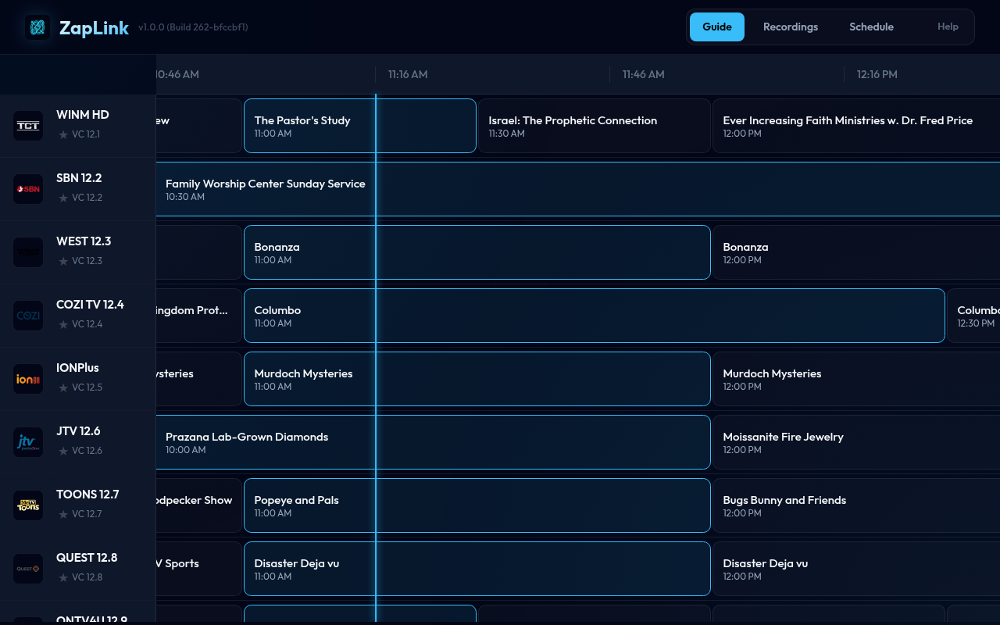
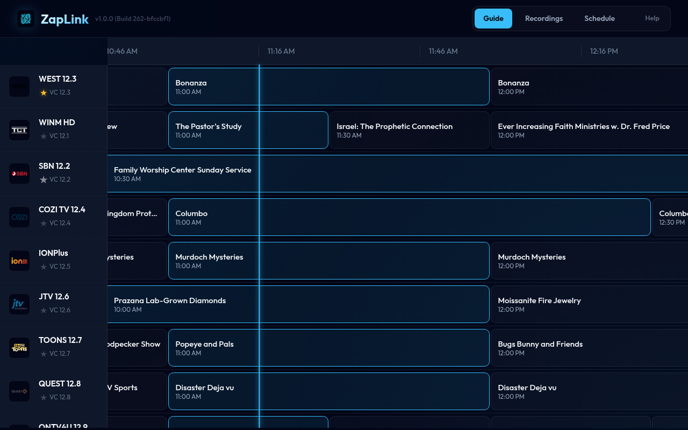
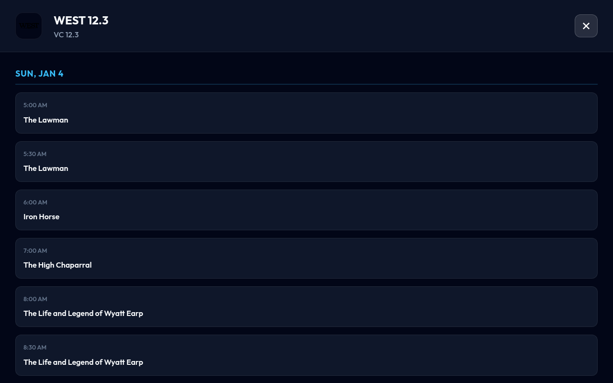
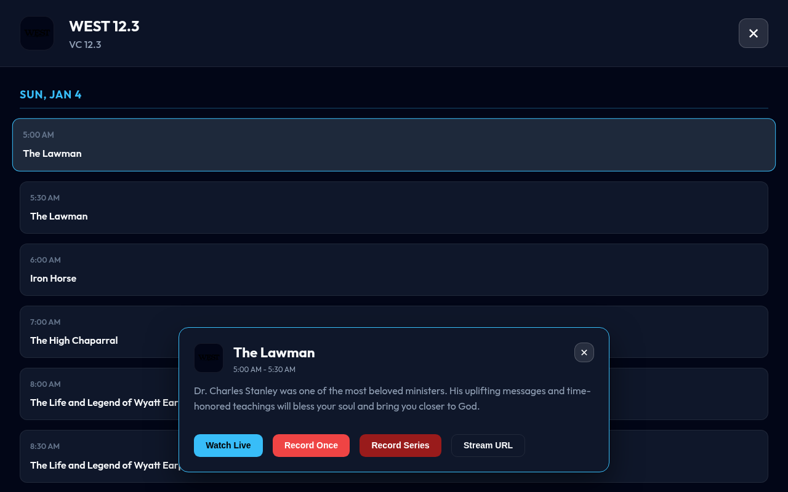

# ZapLink 📺

A high-performance ExpressJS server for turning your USB DVB/ATSC tuners into a network-accessible M3U playlist with full XMLTV Electronic Program Guide (EPG) support.

## 🚀 Features

- **Multi-Tuner Support**: Automatically discovers and manages multiple tuners in `/dev/dvb`.
- **EPG Engine**: Built-in parser for ATSC (EIT/VCT) and DVB program guides.
- **Smart Mapping**: Automatically maps ATSC Source IDs to Virtual Channel numbers (e.g., 55.1).
- **XMLTV Excellence**: Generates standard XMLTV files with local timezone support and proper entity escaping (no more "Rizzoli & Isles" ampersand crashes).
- **Smart Disambiguation**: Tunes using Virtual Channel numbers instead of section names, allowing multiple channels with the same name (e.g., "Bounce") to coexist without conflict.
- **Hardware & Software Transcoding**: Robust support for Intel **QSV**, NVIDIA **NVENC**, and **VA-API** hardware acceleration, plus specialized software transcoding.
- **Multiple Codecs**: Choice of **H.264**, **H.265 (HEVC)**, or **AV1** output for any transcoding mode.
- **Smart Scanning**: Only runs a full EPG scan on startup if the database is missing; otherwise refreshes every 15 minutes.
- **Interactive Dashboard**: Modern web interface to view "Now Playing" status and launch streams directly.
- **Real-time Updates**: WebSocket integration for live feedback on scans, tuner status, and recordings.
- **Round-Robin Preemption**: Distributes tuner load and supports preemption logic.

## 📸 Dashboard Preview

| **Main Guide** | **Favorites Pinned** |
|:---:|:---:|
|  |  |

| **Channel Detail (7-Day)** | **Program Details** |
|:---:|:---:|
|  |  |

## 🛠️ Prerequisites

- **Node.js**: v18 or higher.
- **dvbv5-zap**: Part of the `v4l-utils` package.
- **FFmpeg**: For streaming and transcoding.
- **SQLite3**: For EPG data storage.

```bash
# Ubuntu/Debian
sudo apt update
sudo apt install v4l-utils ffmpeg nodejs npm sqlite3
```

## 📦 Installation

1. Clone the repository into `/opt`:

    ```bash
    # Replace with your repository URL
    sudo git clone https://github.com/kmitchel/zaplink.git /opt/zaplink
    cd /opt/zaplink
    ```

2. Set permissions for the `zaplink` user:

    ```bash
    sudo chown -R zaplink:zaplink /opt/zaplink
    ```

3. Install dependencies:

    ```bash
    sudo -u zaplink npm install
    ```

4. **Generate Channel Configuration**:

    We provide an interactive helper script to fetch channel data from RabbitEars and generate a configuration file optimized for US broadcasts.

    ```bash
    sudo -u zaplink npm run scan-channels
    ```

    Follow the interactive prompts to enter your zip code.
    > [!WARNING]
    > **VHF Channels (2-13)**: These lower frequency channels propagate further but often have weaker signal strength on modern "digital" antennas (there is nothing modern or digital about an antenna; RF is RF, and a UHF antenna is just a UHF antenna), which are primarily designed for UHF. If scanning takes a very long time or fails, use the option to **skip VHF channels** when prompted.

    Once the scan is complete, move the generated file to `/opt/zaplink/channels.conf`:

    ```bash
    mv scripts/channels.conf channels.conf
    sudo chown zaplink:zaplink channels.conf
    ```

5. **Channel Icons (Optional)**:
   Create a `logos.json` in the project root to map channel numbers or names to icon URLs. An example file `logos.json.example` is provided:
    ```bash
    cp logos.json.example logos.json
    ```
    **Example `logos.json` structure:**
    ```json
    {
        "15.1": "https://example.com/abc-logo.png",
        "55.2": "https://example.com/bounce.png"
    }
    ```
    The app will automatically include these in the M3U (`tvg-logo`) and XMLTV (`<icon src="..." />`) outputs.
    ```bash
    sudo chown zaplink:zaplink logos.json
    ```

## ⚙️ Systemd Service & Permissions

Running the application with `sudo` is discouraged for security reasons. Follow these steps to run the tuner as the `zaplink` user.

### 1. Configure User Permissions

The `zaplink` user needs access to the application files, the DVB hardware, and the Intel GPU (for QSV).

```bash
# Create the zaplink system user
sudo useradd -r -s /usr/sbin/nologin zaplink

# Set ownership of the application directory
sudo chown -R zaplink:zaplink /opt/zaplink

# Add zaplink to necessary groups (video, render, and tvheadend)
sudo usermod -aG video,render,tvheadend zaplink
```

### 2. Install the Systemd Service

You can either link the service file directly from the repository (recommended for easy updates) or create it manually.

#### Option A: Link the service file (Recommended)

This method links the service file from the project directory, so updates to the file in the repository are automatically applied.

```bash
sudo systemctl link /opt/zaplink/zaplink.service
```

#### Option B: Create manually

If you prefer to create the file manually at `/etc/systemd/system/zaplink.service`:

```bash
sudo nano /etc/systemd/system/zaplink.service
```

**Service File Content:**

```ini
[Unit]
Description=ZapLink Service
After=network.target

[Service]
Type=simple
User=zaplink
Group=zaplink
WorkingDirectory=/opt/zaplink
ExecStart=/usr/bin/node index.js
Restart=always

# Transcoding mode: none (direct copy), soft, qsv, nvenc, vaapi
Environment=TRANSCODE_MODE=none

# Video codec: h264, h265, av1
Environment=TRANSCODE_CODEC=h264
Environment=ENABLE_EPG=true

# Access to DVB and GPU hardware
SupplementaryGroups=video render

[Install]
WantedBy=multi-user.target
```

### 3. Enable and Start

```bash
# Reload systemd to recognize the new service
sudo systemctl daemon-reload

# Enable (start on boot) and start the service now
sudo systemctl enable --now zaplink

# Verify it is running
sudo systemctl status zaplink
```

## 🚦 Usage

Once the service is active, the server is available on port `3000` (default). It will automatically restart if it crashes or the system reboots.

### Environment Variables

| Variable            | Description                                                | Default           |
| :------------------ | :--------------------------------------------------------- | :---------------- |
| `PORT`              | Server port                                                | `3000`            |
| `CHANNELS_CONF`     | Path to your channels file                                 | `./channels.conf` |
| `TRANSCODE_MODE`    | Transcoding mode (`none`, `soft`, `qsv`, `nvenc`, `vaapi`) | `none`            |
| `TRANSCODE_CODEC`   | Video codec (`h264`, `h265`, `av1`)                        | `h264`            |
| `ENABLE_PREEMPTION` | Allow tuners to be stolen                                  | `false`           |
| `ENABLE_EPG`        | Enable EPG scanning                                        | `true`            |
| `VERBOSE_LOGGING`   | Enable deep debug logs                                     | `false`           |

> [!NOTE]
> When `TRANSCODE_CODEC=av1` is selected, the stream automatically switches from the MPEG-TS container to **Matroska (.mkv)** for compatibility.

## 🐳 Docker Deployment

You can also run ZapLink using Docker, which simplifies dependency management.

### 1. Build and Run with Docker Compose

Ensuring your `channels.conf` is in the project root:

```bash
docker-compose up -d --build
```

### 2. Manual Docker Build & Run

```bash
# Build the image
docker build -t zaplink .

# Run the container
docker run -d \
  --name zaplink \
  --privileged \
  --network host \
  -v $(pwd)/channels.conf:/app/channels.conf \
  -v $(pwd)/logos.json:/app/logos.json \
  -v $(pwd)/epg.db:/app/epg.db \
  -v /dev/dvb:/dev/dvb \
  zaplink
```

**Note:** The `--privileged` flag and `--network host` are recommended for reliable access to DVB hardware and low-latency streaming.

### 🎮 Hardware Acceleration

To use hardware transcoding in Docker, you must pass through your GPU hardware to the container.

#### 🔹 Intel Quick Sync (QSV)

Requires a `Gen 7` or newer Intel iGPU.

- **Compose**:
    ```yaml
    devices:
        - /dev/dri:/dev/dri
    environment:
        - TRANSCODE_MODE=qsv
        - TRANSCODE_CODEC=h264
    ```
- **CLI**:
    ```bash
    docker run [...] --device /dev/dri:/dev/dri -e TRANSCODE_MODE=qsv -e TRANSCODE_CODEC=h264 zaplink
    ```

#### 🔹 NVIDIA (NVENC)

Requires the [NVIDIA Container Toolkit](https://docs.nvidia.com/datacenter/cloud-native/container-toolkit/latest/install-guide.html).

- **Compose**:
    ```yaml
    deploy:
        resources:
            reservations:
                devices:
                    - driver: nvidia
                      count: 1
                      capabilities: [gpu]
    environment:
        - TRANSCODE_MODE=nvenc
        - TRANSCODE_CODEC=h264
    ```
- **CLI**:
    ```bash
    docker run [...] --gpus all -e TRANSCODE_MODE=nvenc -e TRANSCODE_CODEC=h264 zaplink
    ```

#### 🔹 AMD/Intel (VA-API)

The open standard for Linux. Useful if QSV isn't working or for AMD GPUs.

- **Compose**:
    ```yaml
    devices:
        - /dev/dri:/dev/dri
    environment:
        - TRANSCODE_MODE=vaapi
        - TRANSCODE_CODEC=h264
    ```
- **CLI**:
    ```bash
    docker run [...] --device /dev/dri:/dev/dri -e TRANSCODE_MODE=vaapi -e TRANSCODE_CODEC=h264 zaplink
    ```

## 🔗 Endpoints

ZapLink provides several endpoints for both media players and programmatic access via a JSON API.

### 📺 Media Endpoints

| Endpoint | Description | Parameters |
| :--- | :--- | :--- |
| `/playlist.m3u` | **M3U Playlist** for Jellyfin/VLC. | `f`: format (ts, mp4, mkv)<br>`c`: codec (copy, h264, h265, av1) |
| `/xmltv.xml` | **XMLTV Guide** data. | None |
| `/stream/:channel` | **Live Stream** a channel. | **Path**: `/:format/:codec`<br>**Query**: `?f=...&c=...` |

**Stream Example**: `http://localhost:3000/stream/5.1/mp4/h264`

### 🛠️ JSON API

| Endpoint | Method | Description |
| :--- | :--- | :--- |
| `/api/guide` | `GET` | Returns full channel list with 12h of program data. |
| `/api/now-playing`| `GET` | Quick snapshot of what is currently on every channel. |
| `/api/timers` | `GET` | List all scheduled recordings (once or series). |
| `/api/timers` | `POST` | Schedule a recording. |
| `/api/recordings` | `GET` | List all completed and active recordings. |
| `/api/play/:id` | `GET` | Stream a recording with optional transcoding. |
| `/api/version` | `GET` | Returns the current build hash and version. |

### 📡 WebSocket API

The server broadcasts real-time updates to all connected clients.

| Event Type | Description | Data Fields |
| :--- | :--- | :--- |
| `tuner_status` | Status of hardware tuners. | `tunerId`, `status` (acquired, released, scanning) |
| `epg_scan_progress` | Progress of background EPG scans. | `currentMux`, `totalMuxes`, `percent` |
| `recording_status` | Updates on DVR recording jobs. | `recId`, `status` (starting, recording, finished, failed) |

## 🧠 Technical Details

### EPG Storage

EPG data is stored in `epg.db`. The application enforces a strict uniqueness constraint on `(channel, start_time)` to prevent duplicate entries even when receiving redundant data from multiple muxes.

### ATSC Parsing

The parser handles Multi-String Structure (MSS) titles and correctly handles GPS-to-Unix epoch conversions, including duration bitmask fixes for North American broadcasts.

### Channel Disambiguation

The application uses the `VCHANNEL` number for tuning via `dvbv5-zap` instead of the section name. This means that if your `channels.conf` has multiple sections named `[Bounce]`, they will all stay as-is, and the app will reliably choose the correct one based on its unique subchannel number (e.g., 55.1 vs 55.2).

## 🔧 Troubleshooting

### Clearing Jellyfin EPG Cache

If you update your `channels.conf` or notice your guide is stale/incorrect in Jellyfin, you may need to clear Jellyfin's internal XMLTV cache. Jellyfin sometimes caches the XML structure even if the file on disk has changed.

1. **Stop Jellyfin Server**:

    ```bash
    sudo systemctl stop zaplink
    ```

2. **Delete the Cache Directories**:
    - **Native Linux (Debian/Ubuntu)**:
        ```bash
        sudo rm -rf /var/cache/jellyfin/xmltv/
        sudo rm -rf /var/cache/jellyfin/*_channels
        ```
    - **Docker**:
      Locate your mapped `cache` volume and delete the `xmltv` folder within it.

3. **Start Jellyfin Server**:

    ```bash
    sudo systemctl start jellyfin
    ```

4. **Refresh Guide Data**:
   In the Jellyfin Dashboard, go to **Live TV** and click **Refresh Guide Data**.

## 📄 License

ISC

## 🧪 Status

This project is currently under active development. The latest version features:

- **Real-time WebSockets**: Live status updates for EPG scans and tuner activity.
- **Native H.264/MP4 Streaming**: Live TV and recordings stream in browser-compatible formats.
- **Transcoding Polish**: Significant improvements to HLS and file transcoding stability.
